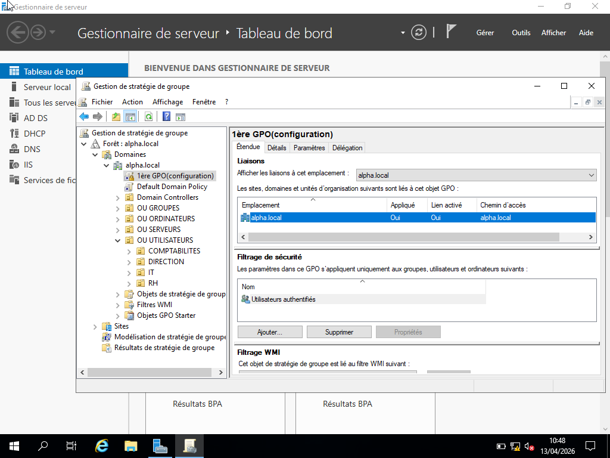
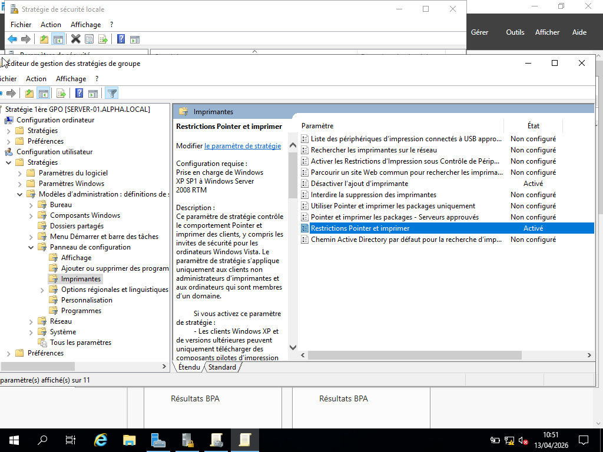
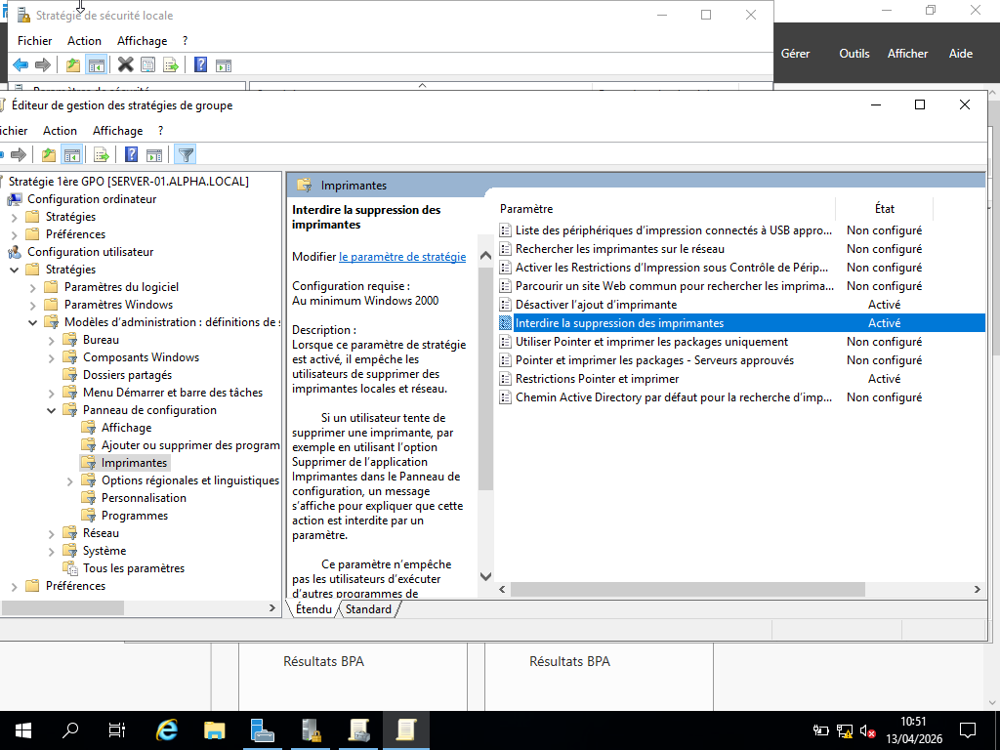
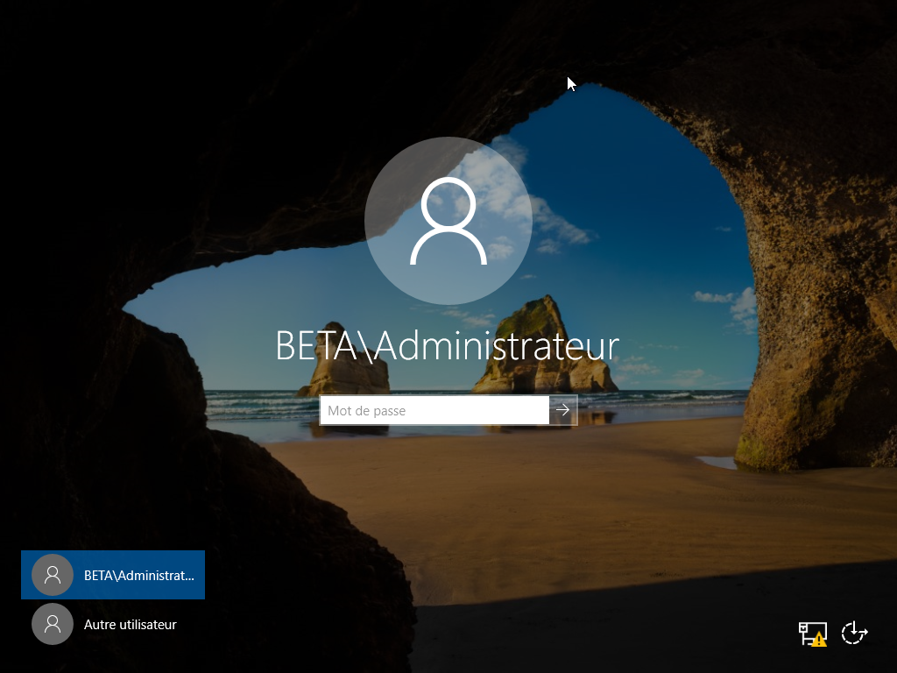
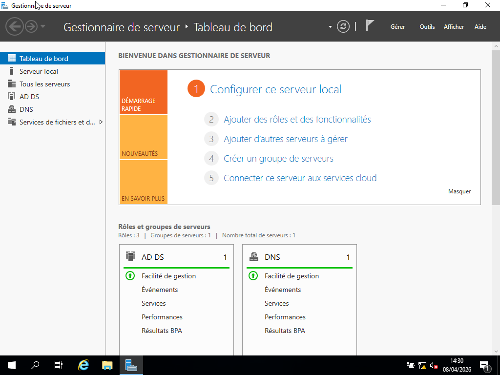
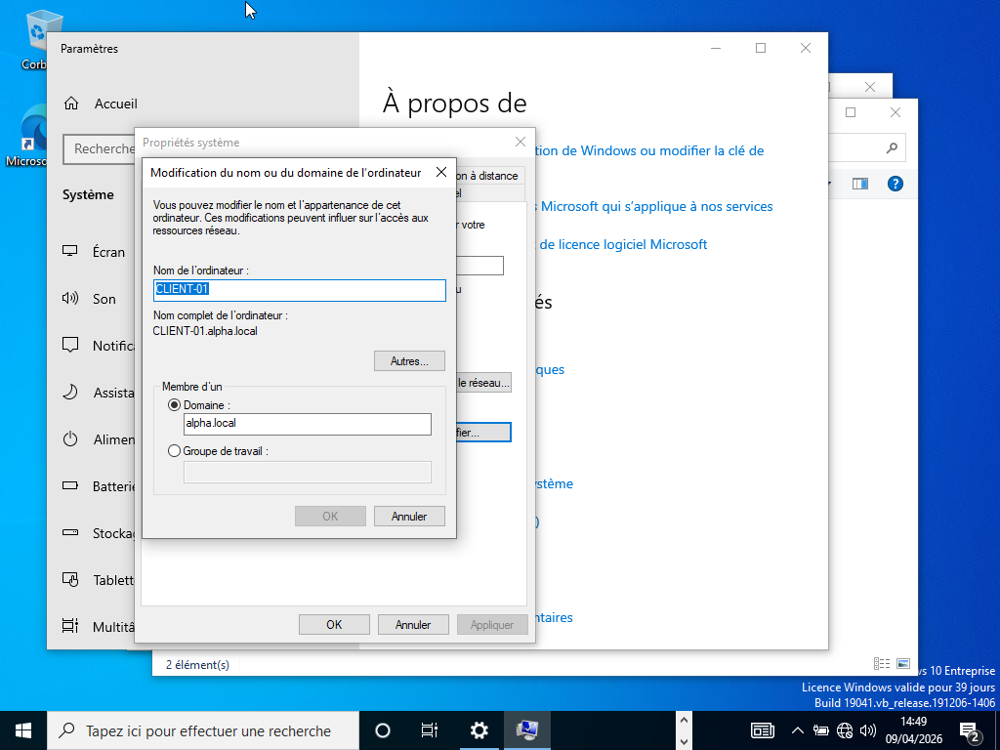

#  Screenshots
Ce dossier contiendra les captures d’écran du projet :

## Domaine ALPHA (principal)

### Installation Active Directory

Installation du rôle AD DS et préparation du serveur pour la promotion en contrôleur de domaine.

### Connexion au domaine

Connexion réussie avec un compte du domaine alpha.local.

### Dashboard serveur

Vérification des rôles AD DS et DNS actifs sur le serveur.

##  Domaine BETA (second contrôleur de domaine)
Le domaine BETA simule une filiale dans une infrastructure multi-domaines.
### Connexion au domaine

Connexion réussie avec un compte du domaine beta.local.

### Dashboard serveur

Vérification des rôles AD DS et DNS actifs sur le serveur BETA.

### Intégration d’un client au domaine
Objectif :  
Intégrer une machine Windows 10 (CLIENT-01) au domaine Active Directory alpha.local.

Étapes réalisées :  
- Configuration réseau du client  
- Connexion au domaine alpha.local  
- Authentification avec un compte administrateur  
- Redémarrage de la machine  

Résultat :  
La machine CLIENT-01 est désormais membre du domaine et peut communiquer avec le contrôleur de domaine.

Preuves :
Les screenshots suivantes montrent la réussite de l’intégration du client au domaine ainsi que la communication avec le contrôleur de domaine.
Preuves :

Les captures d’écran ci-dessous montrent la réussite de l’intégration du client au domaine ainsi que la communication avec le contrôleur de domaine.

.png)

